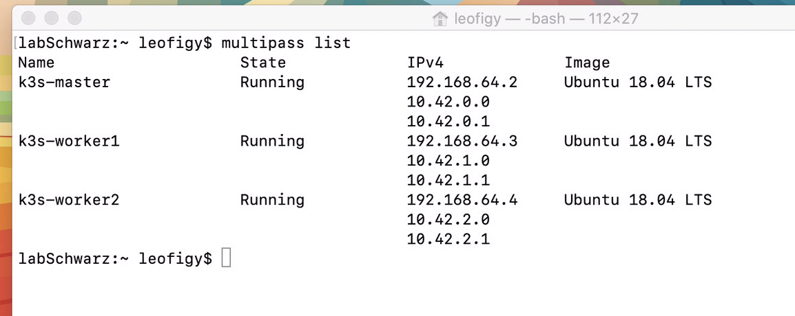

## requisitos

- Windows pro (10/11), macos (catalina or newer) or linux
- git for windows just in case https://gitforwindows.org/
- Instalar multipass https://multipass.run/install para la plataforma adecuada
- Instalar kubectl
  -  https://kubernetes.io/es/docs/tasks/tools/included/install-kubectl-windows/
  -  https://kubernetes.io/es/docs/tasks/tools/included/install-kubectl-linux/
  -  https://kubernetes.io/docs/tasks/tools/install-kubectl-macos/

- Crearemos 3 maquinas virtuales para tener un cluster de k3s 

```
 multipass launch -c 1 -m 1G -d 4G -n k3s-master 18.04
 multipass launch -c 1 -m 1G -d 4G -n k3s-worker1 18.04
 multipass launch -c 1 -m 1G -d 4G -n k3s-worker2 18.04
```
- Instalar k3s en el nodo maestro

```
multipass exec k3s-master -- bash -c "curl -sfL https://get.k3s.io | sh -"
```
- obtener el token dentro del cluster para poder agregar los nodos

```
TOKEN=$(multipass exec k3s-master sudo cat /var/lib/rancher/k3s/server/node-token)
```
- obtener la IP del nodo maestro 
```
IP=$(multipass info k3s-master | grep IPv4 | awk '{print $2}')
```
- repetir el proceso por cada nodo trabajador
```
 for f in 1 2; do
     multipass exec k3s-worker$f -- bash -c "curl -sfL https://get.k3s.io | K3S_URL=\"https://$IP:6443\" K3S_TOKEN=\"$TOKEN\" sh -"
 done
```

Al final tendremos un cluster virtualizado seteado 




Basado en el tutorial [fuente](https://andreipope.github.io/tutorials/create-a-cluster-with-multipass-and-k3s.html)

### [regresar](README.md)
